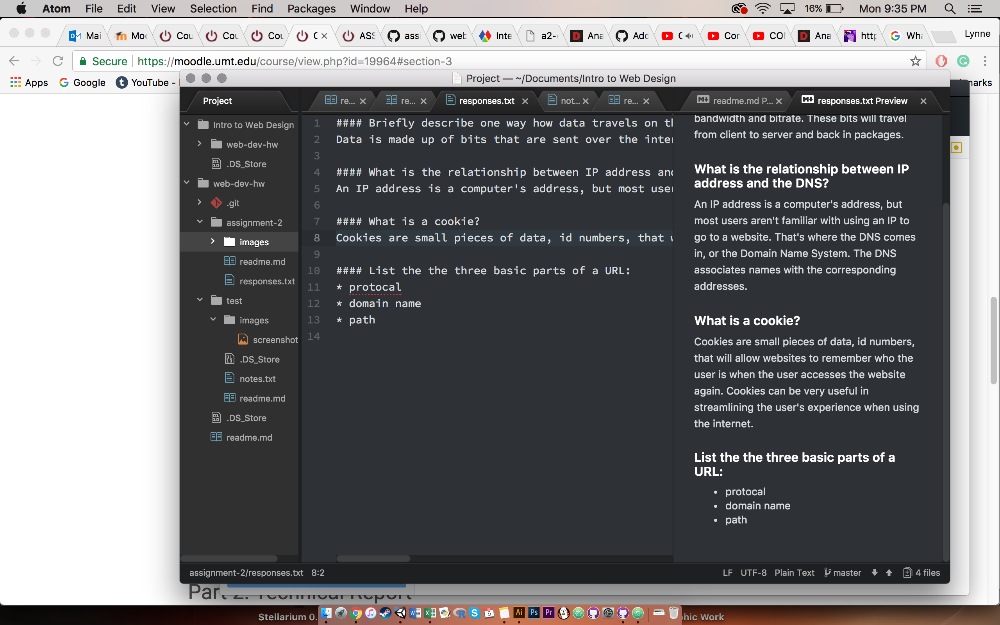

# Assignment 2

A Version Control System is a system that allows a developer to make changes to a file and track those changes and their history. The developer can apply changes with a simple associated message. But, if a change wasn't appropriate or wrong, the developer can even revert back to a previous version of their work. Along with the previously metioned benefits, version control allows for collaboration and makes sharing much easier.

We are using Version Control so we can easily keep track of our changes over time, have more room for error, have easily accessible repositories, have access to free cloud backup and a free hosted website, and so we can get comfortable with tools that are an industry standard.

My [responses](./responses.txt)

This work cycle went nicely and without any problems popping up. This last week was hectic and crazy so I wasn't able to spend a lot of time on this class, as such, I was unable to help fellow classmates with issues, but hopefully, I will have plenty of time next week. Since I haven't had a lot of time, it's a relief that no issues came up. Everything made sense and I had no problems completing the assignment.

