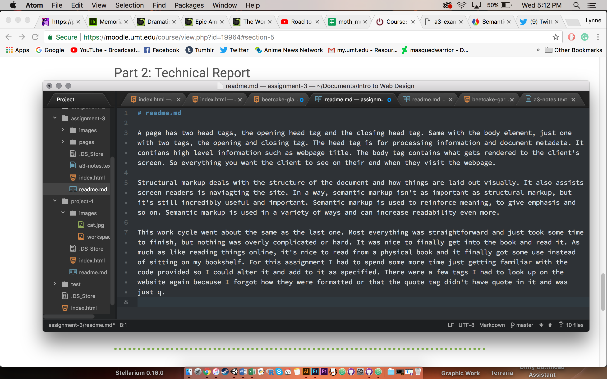

# readme.md

A page has two head tags, the opening head tag and the closing head tag. Same with the body element, just one with two tags, the opening and closing tag. The head tag is for processing information and document metadata. It contians high level information such as webpage title. The body tag contains what gets rendered to the client's screen. So everything you want the client to see on their end when they visit the webpage.

Structural markup deals with the structure of the document and how things are laid out visually. It also assists screen readers is naviagting the site. In a way, semantic markup isn't as important as structural markup, but it's still incredibly useful and important. Semantic markup is used to reinforce meaning, to give emphasis and so on. Semantic markup is used in a variety of ways and can increase readability even more.

This work cycle went about the same as the last one. Most everything was straightforward and just took some time to finish, but nothing was overly complicated or hard. It was nice to finally get into the book and read it. As much as like reading things online, it's nice to read from a physical book and it finally got some use instead of sitting on my bookshelf. For this assignment I had to spend some more time just getting familiar with the code provided so I could alter it and add to it as specified. There were a few tags I had to look up on the website again because I forgot how they were formatted or that the quote tag didn't have quote in it and was just q.

