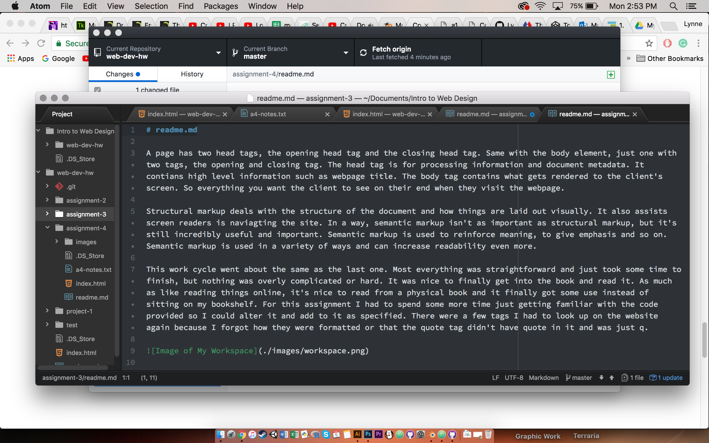

# readme.md

Alt text is for the use of screenreaders. Blind people and others can use screenreaders to help them naviagte the web. Alt text is read out to the screenreader and is usually a description of the image if the information is relavent to them understanding the material. Some images that are purely decorative won't have alt text since it would just be more clutter. Esentially, alt text and image titles are used to help people with disabilities navigate and understand what's on a web page.

Most webpages have some kind of form. For example, all social media sites have user accounts. Without exception, to make a user account on a website, you will be required to fill out a form that will have a username and password required and possibly more. If you are submitting things online, you may also have to fill out forms. Forms are essential for getting information from the user. If you upload a video to YouTube, you have to fill out a bunch of information in a form. Whenever you log into a site, you have to deal with a form. They are very important for the user/web relation and involvement. Forms are a very important part of the interactive side of the internet.

My work cycle was the same as always. The hardest part of this assignment was just remembering all the new material that I was exposed to and how to tag everything and what to include in all the tags. This assignment also was just a greater workload overall so that made it take a little bit longer, but thankfully, some of it was just copy and pasting and changing values and names and ids. But overall, the assignment was still fairly straightforward and it just took time to make it work.

