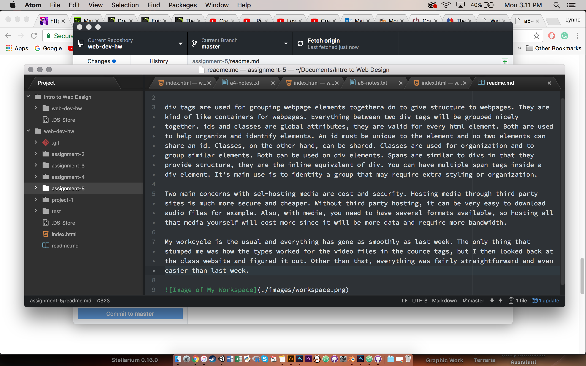

# readme.md

div tags are used for grouping webpage elements togethera dn to give structure to webpages. They are kind of like containers for webpages. Everything between two div tags will be grouped nicely together. ids and classes are global attributes, they are valid for every html element. Both are used to help organize and identify elements. An id must be unique to the element and no two elements can share an id. Classes, on the other hand, can be shared. Classes are used for organization and to group similar elements. Both can be used on div elements. Spans are similar to divs in that they provide structure, they are the inline equivalent of div. You can have multiple span tags inside a div element. It's main use is to identity a group that may require extra styling or organization.

Two main concerns with self-hosting media are cost and security. Hosting media through third party sites is much more secure and cheaper. Without third party hosting, it can be very easy to download audio files for example. Also, with media, you need to have several formats available, so hosting all that media yourself will cost more since it will be more data and require more bandwidth.

My workcycle is the usual and everything has gone as smoothly as last week. The only thing that stumped me was how the types worked for the video files in the cource tags, but I then looked back at the class website and figured it out. Other than that, everything was fairly straightforward and even easier than last week.

