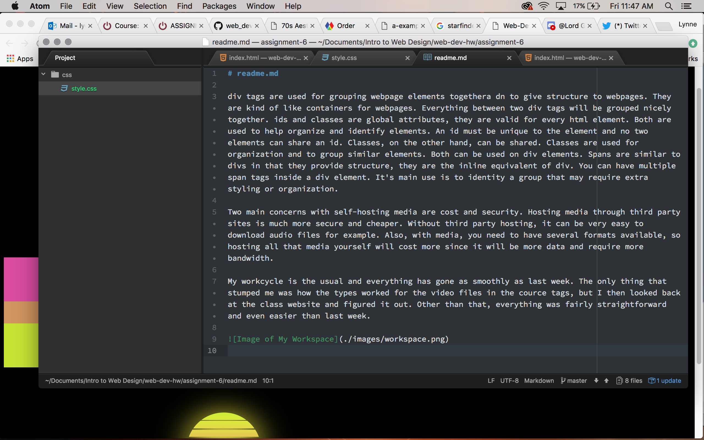

# readme.md

As a 90s kid I'm much more familiar with the 90's aesthetic, that's why I picked it. And I really liked the one image because it made me think of the sunset, that's why I made the background of the page black and I made the colored bars.

The HEX codes are #f451b5, #e9a766, and #ddff15. I wanted to use the colors from the image since I really liked how they went together and I perconally prefer those colors.

I'm turning this in incredibly late because of health reasons I haven't been up to working on projects these past few weeks.

