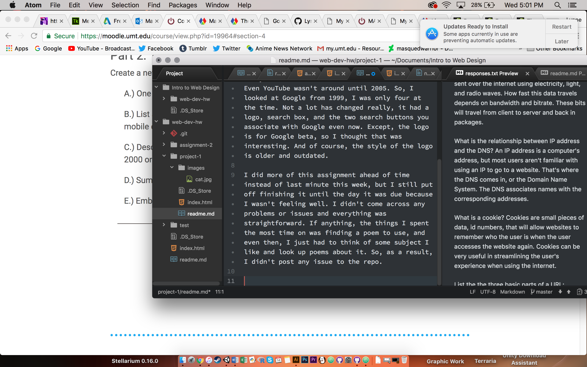

# readme.md

The main web browser I use is Google Chrome and I will very occasionally use Firefox.

A web browser is software/program used to access the internet. Web browsers recognize a few different programming languages, HTML, CSS, and Javascript and translate those languages to what you see on the device screen.

First of all, trying to find a website I use on a daily basis that was aboud before 2000 was hard. Even YouTube wasn't around until 2005. So, I looked at Google from 1999, I was only four at the time. Not a lot has changed really, it had a logo, search box, and the two search buttons you associate with Google even now. Except, the logo is for Google beta, so I thought that was interesting. And of course, the style of the logo is older and outdated.

I did more of this assignment ahead of time instead of last minute this week, but I still put off finishing it until the day it was due because I wasn't feeling well. I didn't come across any problems or issues and everything was straightforward. If anything, the things I spent the most time on was finding a poem to use, and even then, I just had to think of some subject I like and look up poems about it. So, as a result, I didn't post any issue to the repo.

