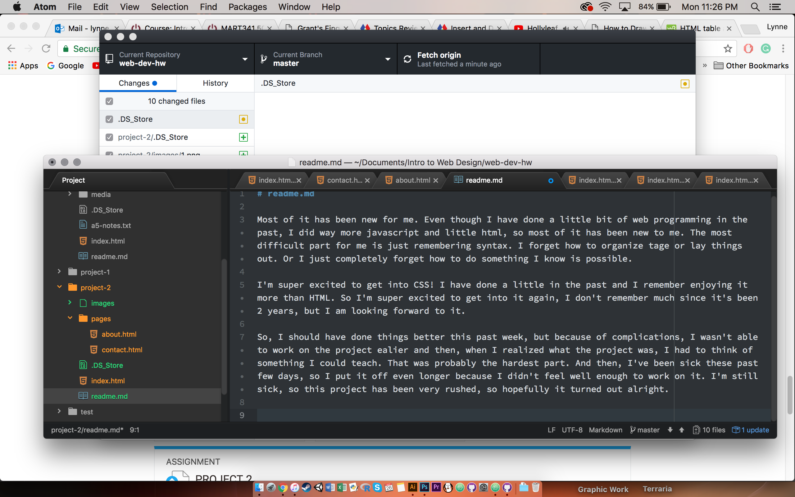

# readme.md

Most of it has been new for me. Even though I have done a little bit of web programming in the past, I did way more javascript and little html, so most of it has been new to me. The most difficult part for me is just remembering syntax. I forget how to organize tage or lay things out. Or I just completely forget how to do something I know is possible.

I'm super excited to get into CSS! I have done a little in the past and I remember enjoying it more than HTML. So I'm super excited to get into it again, I don't remember much since it's been 2 years, but I am looking forward to it.

So, I should have done things better this past week, but because of complications, I wasn't able to work on the project ealier and then, when I realized what the project was, I had to think of something I could teach. That was probably the hardest part. And then, I've been sick these past few days, so I put it off even longer because I didn't feel well enough to work on it. I'm still sick, so this project has been very rushed, so hopefully it turned out alright.

